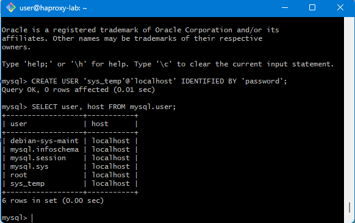
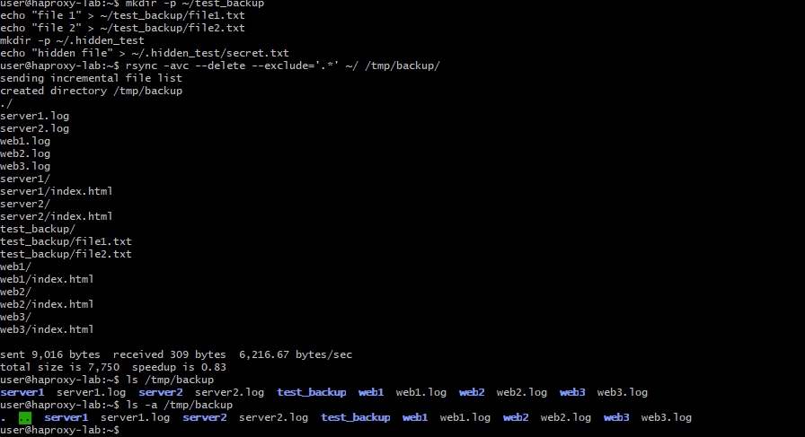
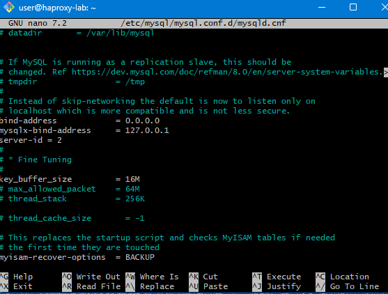

# Домашнее задание «Работа с данными (DDL/DML)»

Александр Масайлов

---

## Задание 1

### 1.1

Установил MySQL 8.

Проверил версию:

```bash
mysql --version
```

### 1.2

Зашёл в MySQL:

```bash
sudo mysql
```

Создал пользователя:

```sql
CREATE USER 'sys_temp'@'localhost' IDENTIFIED BY 'password';
```

### 1.3

Посмотрел список пользователей:

```sql
SELECT user, host FROM mysql.user;
```

Скриншот:



### 1.4

Выдал пользователю все права:

```sql
GRANT ALL PRIVILEGES ON *.* TO 'sys_temp'@'localhost' WITH GRANT OPTION;
FLUSH PRIVILEGES;
```

### 1.5

Проверил права пользователя:

```sql
SHOW GRANTS FOR 'sys_temp'@'localhost';
```

Скриншот:



### 1.6

Подключился под пользователем `sys_temp`:

```bash
mysql -u sys_temp -ppassword
```

### 1.7

Скачал и распаковал базу Sakila:

```bash
wget https://downloads.mysql.com/docs/sakila-db.zip

unzip sakila-db.zip
```

Создал базу:

```sql
CREATE DATABASE sakila;
```

Загрузил структуру и данные:

```bash
mysql -u sys_temp -ppassword sakila < sakila-db/sakila-schema.sql

mysql -u sys_temp -ppassword sakila < sakila-db/sakila-data.sql
```

### 1.8

Подключился к базе:

```sql
USE sakila;
```

Посмотрел список таблиц:

```sql
SHOW TABLES;
```

Скриншот:



---

## Задание 2

Получил список таблиц и их первичных ключей:

```sql
SELECT
TABLE_NAME,
COLUMN_NAME
FROM information_schema.KEY_COLUMN_USAGE
WHERE TABLE_SCHEMA='sakila'
AND CONSTRAINT_NAME='PRIMARY';
```

| Таблица | Первичный ключ |
|----------|----------------|
| actor | actor_id |
| address | address_id |
| category | category_id |
| city | city_id |
| country | country_id |
| customer | customer_id |
| film | film_id |
| film_actor | actor_id, film_id |
| film_category | film_id, category_id |
| film_text | film_id |
| inventory | inventory_id |
| language | language_id |
| payment | payment_id |
| rental | rental_id |
| staff | staff_id |
| store | store_id |
