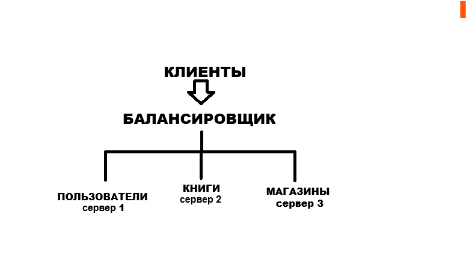

# Домашнее задание «Репликация и масштабирование. Часть 2»

Александр Масайлов

---

## Задание 1

### Активный Master и пассивный Slave

В этой схеме все изменения записываются на Master. Slave нужен как резервный сервер и автоматически получает изменения с Master.

Плюсы:

- если Master перестанет работать, можно переключиться на Slave;
- данные всегда есть в копии;
- часть запросов на чтение можно отправлять на Slave;
- меньше нагрузка на основной сервер.

### Master и несколько Slave

Здесь один Master и несколько Slave.

Плюсы:

- запросы на чтение можно распределить между несколькими серверами;
- нагрузка становится меньше;
- если один Slave перестанет работать, остальные продолжат работать;
- такую систему проще расширять.

---

## Задание 2

### Горизонтальный шардинг

Я бы разделил данные по разным серверам.

Например:

- первый сервер — пользователи;
- второй сервер — книги;
- третий сервер — магазины.

Так каждый сервер будет работать только со своей частью данных.

### Вертикальный шардинг

Если таблицы станут очень большими, можно разделить их по данным.

Например, в таблице пользователей:

- в одной базе хранить логин, пароль и почту;
- в другой — адрес, телефон и другую информацию.

Так нагрузка тоже станет меньше.

### Схема

Все серверы работают одновременно. Каждый отвечает только за свои данные.
