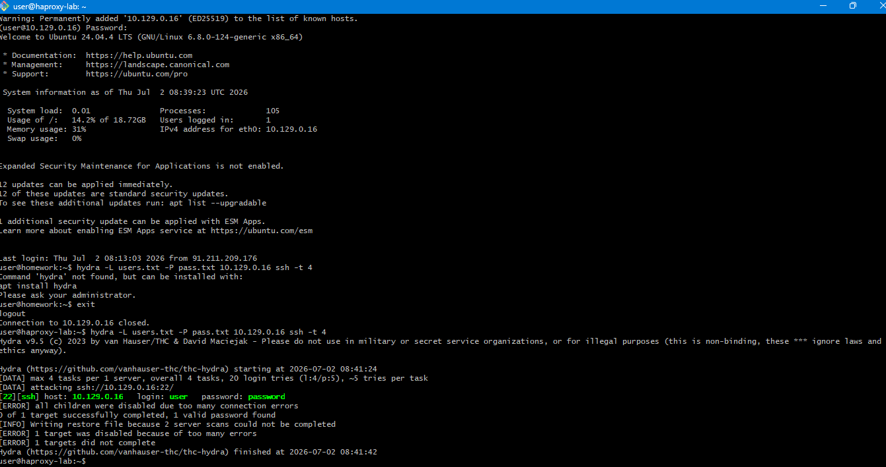
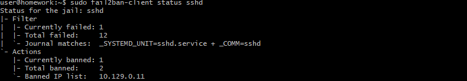
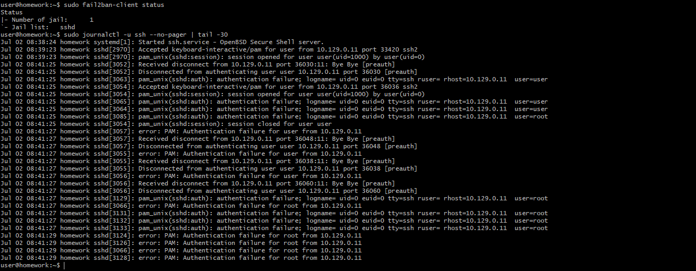

## Подготовка системы

Suricata и Fail2Ban успешно установлены и запущены.


## Сканирование системы

Были выполнены команды:

```bash
sudo nmap -sA 10.129.0.16
sudo nmap -sT 10.129.0.16
sudo nmap -sS 10.129.0.16
sudo nmap -sV 10.129.0.16
```

В результате были обнаружены открытые службы:

- SSH (22)
- MySQL (3306)


### События Suricata

Во время выполнения работы Suricata была запущена и отслеживала сетевой трафик.


### События Fail2Ban

До выполнения атаки Fail2Ban был запущен и отслеживал SSH.


## Задание 2

Для подбора пароля использовалась команда:

```bash
hydra -L users.txt -P pass.txt 10.129.0.16 ssh -t 4
```

Hydra успешно подобрала пароль пользователя `user`.



После нескольких неудачных попыток входа Fail2Ban заблокировал IP-адрес атакующей машины.



В журнале SSH видны неудачные попытки авторизации.


