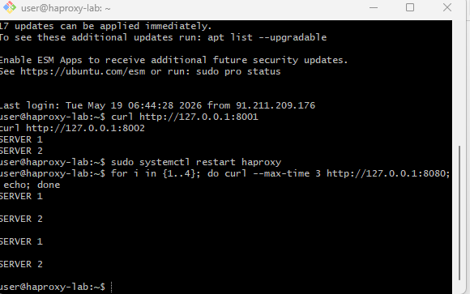
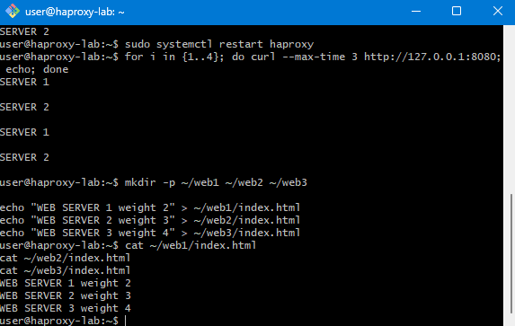
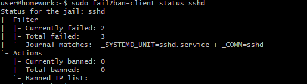

# Домашнее задание «Кластеризация и балансировка нагрузки»

Выполнил: Александр Масайлов

## Задание 1

Запустил 2 Python-сервера на портах 8001 и 8002.

Настроил HAProxy с балансировкой Round Robin.

Конфигурация:

```cfg
frontend task1_front
    bind *:8080
    mode tcp
    default_backend task1_back

backend task1_back
    mode tcp
    balance roundrobin
    server server1 127.0.0.1:8001 check
    server server2 127.0.0.1:8002 check
```

Скриншоты:


---

## Задание 2

Запустил 3 Python-сервера на портах 8011, 8012 и 8013.

Настроил Weighted Round Robin.

Конфигурация:

```cfg
frontend task2_front
    bind *:8081
    mode http

    acl is_example hdr_beg(host) -i example.local
    use_backend task2_back if is_example
    default_backend deny_backend

backend task2_back
    mode http
    balance roundrobin
    server web1 127.0.0.1:8011 check weight 2
    server web2 127.0.0.1:8012 check weight 3
    server web3 127.0.0.1:8013 check weight 4

backend deny_backend
    mode http
    http-request deny deny_status 403
```

Скриншоты:








