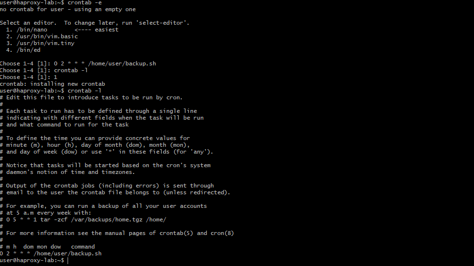

# Домашнее задание к занятию «Система мониторинга Zabbix. Часть 2»

Выполнил: Александр Масайлов

---

## Задание 1

Создан собственный шаблон с элементами данных.

### Скриншот шаблона

---

## Задание 2-3

Добавлены два хоста:
- zabbix-server
- zabbix-agent-2

К обоим хостам привязаны:
- Linux by Zabbix agent
- собственный шаблон

### Скриншот хостов

---

## Задание 4

Создан кастомный Dashboard с графиками.

### Скриншот Dashboard

